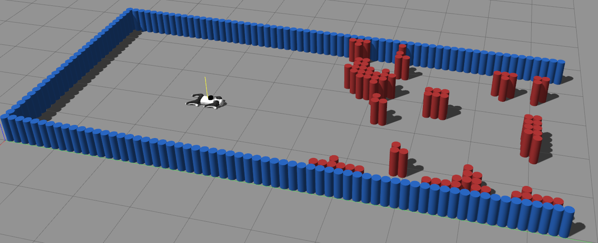
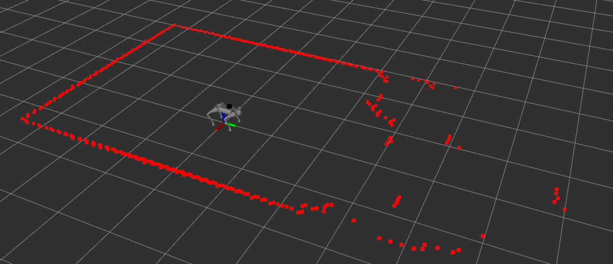
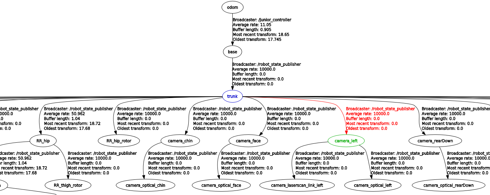

# Unitree Go1 tutorial
This repository is based on Unitree's repositories and aims to add the compatibility of the ROS packages with ROS Noetic.
We will need four repositories:
* [unitree_ros](https://github.com/unitreerobotics/unitree_ros)
* [unitree_legged_sdk](https://github.com/unitreerobotics/unitree_legged_sdk)
* [unitree_ros_to_real](https://github.com/unitreerobotics/unitree_ros_to_real)
* [unitree_guide](https://github.com/unitreerobotics/unitree_guide)

If you want to do the simulation, you might only need to use the package unitree_legged_msgs rather than unitree_ros_to_real. Once all the repositories are ready, we can perform low-level control of the robot's movement. In the Gazebo simulation, we cannot do high-level control, namely walking. For real robots, we can do both-level control using ROS packages.

# Dependencies
* [ROS Noetic](https://www.ros.org/)
* [Gazebo](http://gazebosim.org/)

## Build/Installation
For ROS Noetic:
1. You may need to download these packages from unitree go1, but you may not need to use all of them.
```
sudo apt-get update
sudo apt-get install liblcm-dev
sudo apt-get install ros-noetic-controller-interface ros-noetic-gazebo-ros-pkgs ros-noetic-gazebo-ros-control ros-noetic-joint-state-controller ros-noetic-effort-controllers ros-noetic-joint-trajectory-controller ros-noetic-amcl ros-noetic-move-base ros-noetic-slam-gmapping ros-noetic-hector-slam ros-noetic-map-server ros-noetic-global-planner ros-noetic-dwa-local-planner
```

2. Install Python dependencies
```
pip3 install defusedxml rospkg netifaces numpy
```

3. Create ROS workspace
```
mkdir -p /noetic/unitree_ws/src
cd /noetic/unitree_ws/src
```

4. Clone this repo and required ros packages:
```
git clone https://github.com/unitreerobotics/unitree_ros.git
git clone https://github.com/unitreerobotics/unitree_legged_sdk.git
git clone https://github.com/unitreerobotics/unitree_ros_to_real.git
git clone https://github.com/unitreerobotics/unitree_guide.git
git clone https://github.com/yuanjielu-64/barn_challenge_go1.git
```
Once you have download barn_challenge_go1, please change name to barn_challenge_lu

5. Use catkin_make to build:
```
cd /noetic/unitree_ws/
catkin_make
```

## Run Simulations for BARN challenge
Open a terminal and start Gazebo
```
roslaunch barn_challenge_lu gazebo_launch_test.launch 
```
You can change the world name, robot name and the position (x,y,z, yaw) of the robot in launch file. In Gazebo, the robot should be lying on the ground with joints not activated. You may find an issue where in many worlds, the initial robot dog cannot properly lie down from a standing position. This is because the joints are not enabled by default. When you add
```
<node name="junior_controller" pkg="unitree_guide" type="junior_ctrl" output="screen" />
```
in the launch file, or run the following command
```
rosrun unitree_guide junior_ctrl
```
the problem can be solved. When the robot has stopped moving and is in a resting position on the ground, you can initiate control sequences by using keyboard commands. First, press '2' to activate the FixedStand mode from the default Passive state. Then, press '4' to transition the robot from standing to Trotting mode. Once in Trotting mode, the robot can be navigated using directional controls: 'W', 'A', 'S', and 'D' keys control forward, left, backward, and right movements respectively, while 'J' and 'L' keys rotate the robot left and right. To halt the robot and return it to a stationary standing position, simply press the 'Spacebar'.


The full list of transitions between states available is the following:
* Key '1': FixedStand/FreeStand to Passive
* Key '2': Passive/Trotting to FixedStand
* Key '3': Fixed stand to FreeStand
* Key '4': FixedStand/FreeStand to Trotting
* Key '5': FixedStand to MoveBase
* Key '8': FixedStand to StepTest
* Key '9': FixedStand to SwingTest
* Key '0': FixedStand to BalanceTest

To navigate the robot, we first start the simulation in gazebo
```
roslaunch barn_challenge_lu gazebo_launch_test.launch rviz:=false
```
It already runs the junior_ctrl, then press the keys '2' and '5' to activate the MoveBase mode.
Run the following command
```
roslaunch barn_challenge_lu navigation.launch
```


If you want to run the DDP algorithm to unitree go1, cd to scripts/
```
./build_ddp.sh
```
The previous DDP was configured to use the Hokuyo LiDAR, but the current LiDAR is different, resulting in different reflection data patterns. Previously, the system was designed for the Jackal robot, a differential drive platform, whereas the quadruped robot dog has a different dynamic model. Consequently, the DDP cannot complete all tasks perfectly.

Two examples are shown in


and 


## Details
The move_base for Unitree go1 is in barn_challenge_lu/params. The base represent the base_link, and the topic scan is /go1_gazebo/scan. The TF tree is shown as 

The description of unitree go1 is in unitree_ros/go1_description/urdf/go1.urdf. The radar is installed in urdf, which is different from the official website.

## Contact
For any questions or support, please contact:
📧 Yuanjie Lu - ylu22@gmu.edu